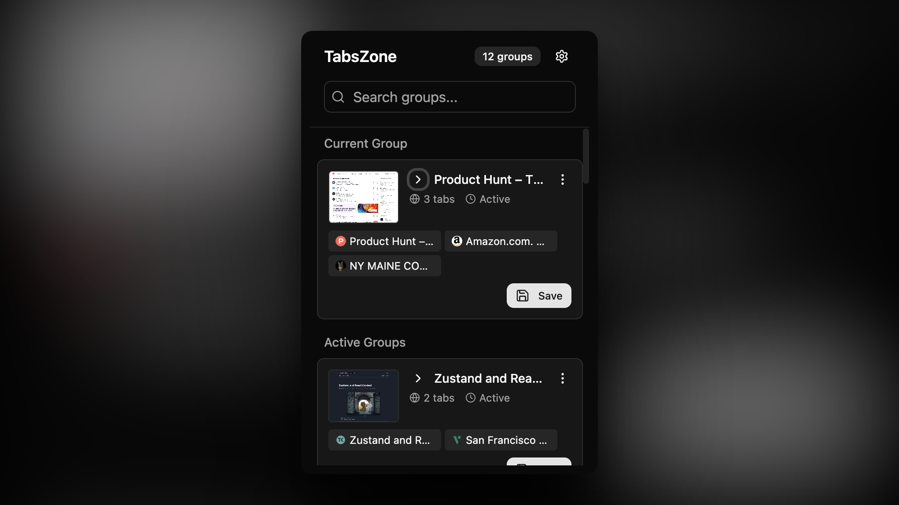

# TabsZone

> Readme written by AI 😉
> **Save and restore groups of tabs like a mini bookmarks manager for your browser windows.**

TabsZone is a powerful Chrome extension that helps you organize, save, and restore collections of browser tabs. Think of it as session management made simple – perfect for managing multiple projects, research sessions, or different browsing contexts.

## ✨ Features

### 🏗️ **Three Smart Sections**

- **Current Group** - Shows tabs from the window you opened the extension in
- **Active Groups** - Displays tabs from other open browser windows
- **Saved Groups** - Your previously saved tab collections

### 📸 **Real Screenshots as Thumbnails**

- Automatically captures screenshots of the first tab in each group
- Visual previews make it easy to identify saved sessions
- Fallback to random placeholder images when screenshots aren't available

### ⚡ **Instant Actions**

- **Live Windows**: Get a "Save" button to preserve the current state
- **Saved Groups**: Get an "Open All" button to restore in a new window
- **Individual Tabs**: Click any tab to open it immediately

### ✏️ **Inline Editing**

- Click any group title to edit it instantly
- Auto-save on Enter, Escape, or click away
- Clean, intuitive interface without modal dialogs

## 🚀 How It Works

### **Current Group**

The window you opened TabsZone from appears as "Current Group" with a blue "Save" button. Click it to preserve this window's tabs as a named collection.

### **Active Groups**

Other browser windows appear as "Active Groups" - each with their own "Save" button. Perfect for organizing different projects or browsing contexts.

### **Saved Groups**

Previously saved tab collections appear with "Open All" buttons. Click to restore all tabs in a new browser window, exactly as they were saved.

## 🛠️ Installation

### From Source

1. Clone this repository
2. Run `pnpm install` to install dependencies
3. Run `pnpm build` to build the extension
4. Open Chrome and go to `chrome://extensions/`
5. Enable "Developer mode" in the top right
6. Click "Load unpacked" and select the `dist` folder
7. The TabsZone icon will appear in your toolbar

## 💡 Usage Tips

### **Organizing Projects**

- Keep work tabs in one window, personal browsing in another
- Save project research as named groups
- Quickly switch between different contexts

### **Session Management**

- Save your current browsing session before closing Chrome
- Restore exact tab configurations for different tasks
- Keep multiple "workspace" configurations ready

### **Research & Learning**

- Save collections of tutorial tabs, documentation, and resources
- Create themed groups like "React Learning" or "Design Inspiration"
- Resume complex research sessions exactly where you left off

## 🔧 Technical Details

### **Built With**

- **React + TypeScript** for the UI
- **Tailwind CSS** for styling
- **shadcn/ui** for components
- **Chrome Extension APIs** for tab and window management
- **Vite + @crxjs/vite-plugin** for development and building

### **Permissions Used**

- `tabs` - Read and create browser tabs
- `storage` - Save tab groups locally
- `activeTab` - Capture screenshots of visible tabs
- `*://*/*` - Access tab content for screenshots

### **Storage**

- Tab groups are saved locally using Chrome's storage API
- Screenshots are stored as base64 images
- No external servers or cloud storage required

## 🎯 Why TabsZone?

Traditional bookmarks are static and don't preserve your browsing context. TabsZone saves the **entire state** of your browser windows - all tabs, their positions, and visual previews. It's like having multiple desktops for your web browsing.

Perfect for:

- **Developers** managing different projects
- **Researchers** organizing complex information gathering
- **Students** keeping course materials separated
- **Anyone** who uses multiple tabs and wants better organization

---

**TabsZone** - Your tabs, organized. 🚀
